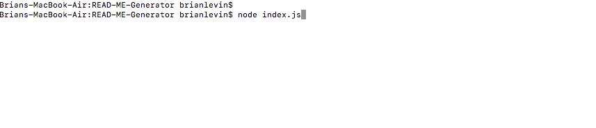
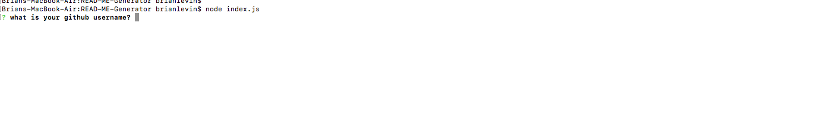
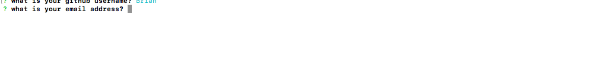
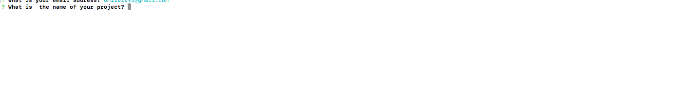
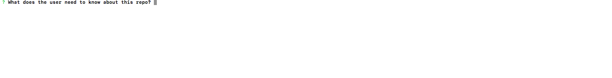
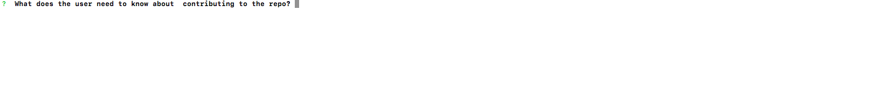
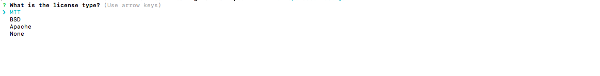

# README Generator

## Description:

In this assignment. we had to create a README generator using node js. The application needed to utilze npm packages  and utilze the npm package inquire to list the questions as prompts. After the user answers the prompts, there input will be generated as a README.
 
 ## Click [here](https://drive.google.com/file/d/1BVwRg4g0RSXd50dIJF3g3vO_Quq0Uz5t/view?usp=sharing) for the live demonstration. 
  
  This is how you start the application in the terminal:
   
  
 
 The first prompt asks the user for their github user name:
 
  
 
 The second prompt asks the user for their email address
 
  
 
 The third prompt asks the user for the name of the project:
 
   
 
 the fourth prompt asks the use how do you install the dependencies:
 
 
 
 The 5th prompt asks the user what they need to know about this repo:
 
 
 
 The 6th prompt asks the user how do they install the tests:
 

  
 
 The 7th prompt asks the user what they need to know about contributing to the repo:
 
 
 
 The final prompt asks the user what is the licence type:
 
   
 
 Below is the generated README from the terminal:
 
 
 # title
 README Generator 

 ## Description
 The purpose of this project was to create a README based off of the prompts the machine asks the user

 ## Test

 ```
 There are no tests for this project
 ```
 
 ```
## install
using npm install 
 ```

## github
Brian

## email
bml201095@gmail.com

## usage
```
This README repo was self generated
```

## contributing

They can contribuate anyway they want

## license

[]

 
 
